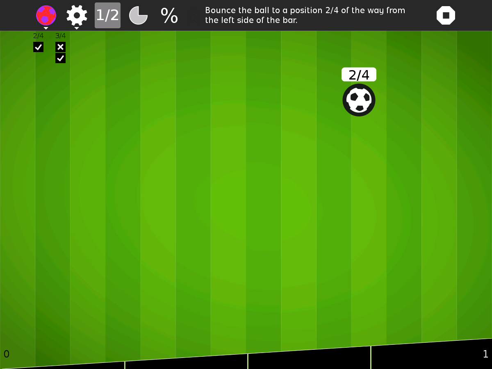
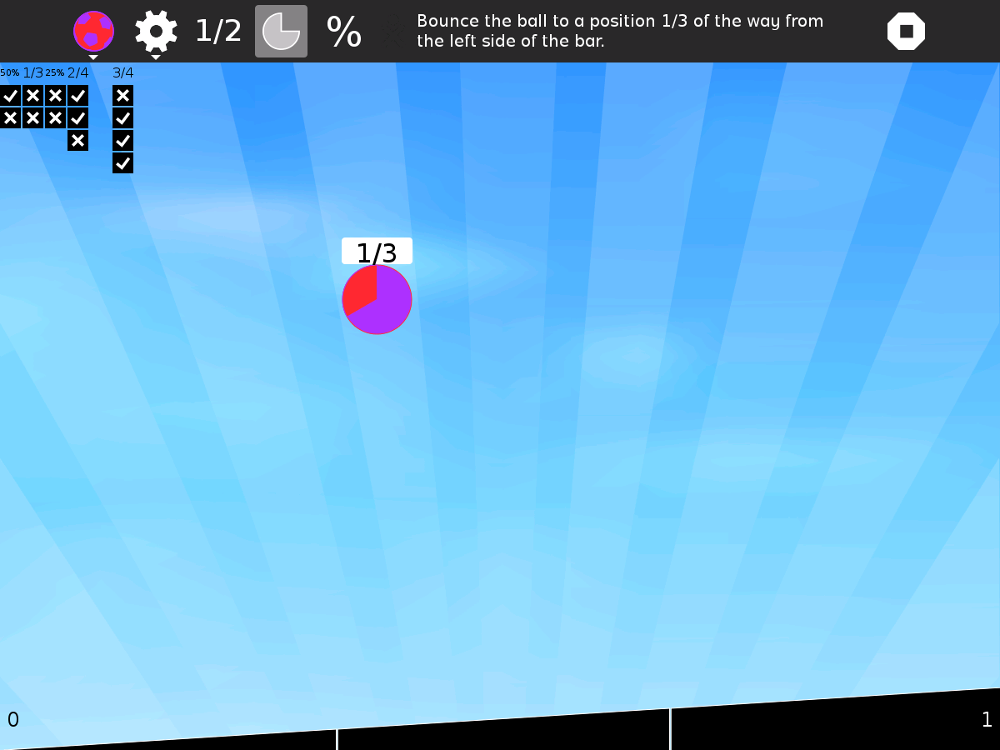
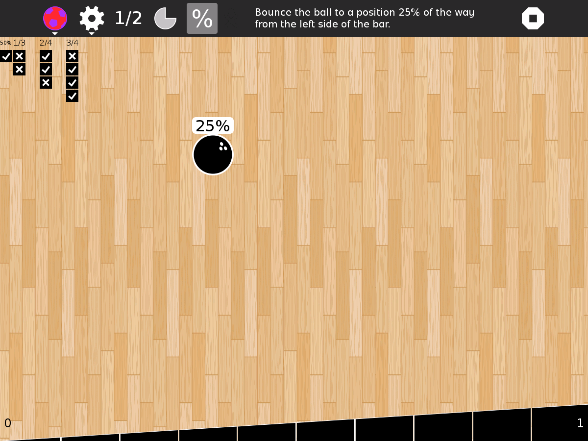

FractionBounce
===============

FractionBounce is a game to nudge a bouncing ball to land at an estimate of a given fraction.  For example, if "2/3" is displayed on the ball, then the ball must land 2/3 the distance along the bottom.

How to use?
===========

* click on the ball to begin, and it will bounce up, then come down,
* before it falls all the way down, use the arrow keys (or the keys <kbd>H</kbd> and <kbd>L</kbd> to move the ball left or right,
* on certain laptops, fold the display and tilt the laptop to control the ball,

When shared, Fraction Bounce can play with up to three other people.  Take turns choosing the fraction to play by clicking on the bar at the bottom of the screen.  For example, if you click halfway across the bar, the fraction 1/2 will be sent to all of the players.

Progress;

* Every time you get a correct answer, a check mark is added to the background image.
* The delay between games decreases the longer you play.
* The complexity of the fractions increases the longer you play.
* Once you get 100 correct answers, the bar at the bottom of the screen becomes solid.
* You can choose between fractions and percentages.
* You can add custom fractions.

Controls;

* The "1/2" button is used to play fractions; the crescent button is used to play a sector; the "%" button is used to play percentages,
* The custom toolbar is used to enter the numerator and denominator of additional fractions. Type in a fraction (numerator and denominator) and then press the "+" button. It will be added to the list of fractions that is used to generate challenges. Fractions must be between 0 and 1.
* The ball can be customized. Choose from either a basketball, a soccer ball, a rugby ball, a bowling ball, a beach ball, a feather, or an image from the Journal.
* The background image can be customized as well. Choose from either grass, wood, sand, clouds, or an image from the Journal.

Screenshots
===========

  
  
  

How to install?
===============

FractionBounce is not part of the Sugar desktop, but can be added.  Please refer to;

* [How to Get Sugar on sugarlabs.org](https://sugarlabs.org/),
* [How to use Sugar](https://help.sugarlabs.org/), and;
* [Download FractionBounce using Browse](https://activities.sugarlabs.org/), search for `FractionBounce`, then download.

How to upgrade?
===============

On Sugar desktop systems;
* use [My Settings](https://help.sugarlabs.org/en/my_settings.html), [Software Update](https://help.sugarlabs.org/en/my_settings.html#software-update), or;
* use Browse to open [activities.sugarlabs.org](https://activities.sugarlabs.org/), search for `FractionBounce`, then download.

How to integrate?
=================

FractionBounce depends on Python, the Sugar Toolkit, and PyGObject bindings for GTK 3, GStreamer, and Telepathy.

FractionBounce is started by [Sugar](https://github.com/sugarlabs/sugar).

How to develop?
===============

* _FractionBounceActivity_ is the main program,
* _collabwrapper_ is collaboration via Telepathy,
* _bounce_, _ball_, _bar_ and _sprites_ are the game and animation,
* _aplay_ is sound effects via GStreamer.

Credits
=======

FractionBounce was written by Walter Bender with input from Paulina Clares, and Chris Rowe. Ignacio Rodriguez ported it to GTK 3. Paul Cotton and Dan Marshall contributed artwork.
